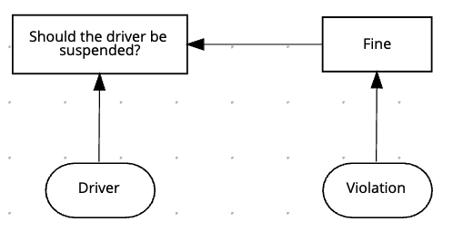

# TRAFFIC VIOLATION
This project implements [RedHat getting started with DMN tutorial](https://docs.redhat.com/en/documentation/red_hat_decision_manager/7.8/html-single/getting_started_with_decision_services/index#dmn-execution-rest-proc).

## Project Overview
The [model](./traffic-violation.dmn) consists of two decisions. First, it decides whether a `Driver` must be `Fine`d. Then, it decides whether `The driver should be suspended`. Therefore, the project has two _Decision_ nodes.

Two _Input Data_ provides necessary information for making decisions: `Driver` and `Violation`.

Three _Custom Data Types_ sets the information structure `Driver`, `Violation`, and `Fine` use.

Finally, one can create a decision table for [testing scenarios](./traffic-violation-test-scenario.scesim).

## Running the Project
You can use either Visual Code [DMN Editor extension](https://marketplace.visualstudio.com/items?itemName=redhat.vscode-extension-dmn-editor) or [KIE Sandbox online](http://dmn.new) for visualising and trying out the project.

## References
- [Drools](https://www.drools.org/learn/dmn.html)
- [Learn DMN in 15 minutes](https://learn-dmn-in-15-minutes.com)
- [Kogito examples](https://github.com/kiegroup/kogito-examples)